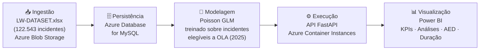

# 🛡️ FlowGuard

**De reativo para preditivo: uma plataforma de AIOps para antecipar quebras de OLA na Locaweb.**

[](https://github.com/Karen-Akemi/FlowGuard)
[](https://github.com/Karen-Akemi/FlowGuard)
[](https://github.com/Karen-Akemi/FlowGuard)
[](#-sobre-o-challenge)

---

## 📌 Sobre o projeto

A Locaweb opera uma infraestrutura de hospedagem 24×7 que acumulou **122.543 incidentes** entre janeiro de 2023 e dezembro de 2025. O time de suporte reage a cada chamado conforme ele chega — sem enxergar o que vem pela frente.

**FlowGuard** vira esse jogo: monitora o histórico de incidentes, **prevê o volume de chamados em D+1 e D+7**, e sinaliza o risco de quebra de OLA *antes* que ele aconteça. Na Sprint 4, deixou de ser slide para virar solução operacional de ponta a ponta — motor preditivo em produção na nuvem, banco gerenciado, API pública e dashboard interativo.

> A partir de setembro de 2025, o volume mensal de incidentes saltou de ~3.500 para mais de 21.000 (**+439,6%**), puxado pela automação de abertura de chamados via monitoramento. Sem visibilidade preditiva, a operação não sabe se um salto de volume é risco real ou apenas mudança de processo — e é exatamente essa lacuna que o FlowGuard fecha.

## 🎯 O que o FlowGuard faz

| | |
|---|---|
| 🔍 **Monitorar** | Acompanha continuamente volume e qualidade do atendimento via KPIs de OLA (Total, Elegíveis, Taxa de Violação, Mediana de Duração) |
| 🔮 **Prever** | Estima o volume diário de incidentes elegíveis a OLA em D+1 e D+7, batendo de forma estatisticamente consistente um baseline sazonal ingênuo |
| ⚠️ **Priorizar** | Aponta equipes, categorias e produtos com maior concentração de risco de violação de OLA |
| ⚡ **Agir** | Apoia a decisão operacional com API pública e dashboard interativo, reduzindo o tempo de reação a picos de demanda |

## 🏗️ Arquitetura



## 📈 Resultados (backtest walk-forward, 56 dias — 03/11 a 28/12/2025)

| Métrica | D+1 | O que significa |
|---|---|---|
| **MAE** | 14,10 incidentes/dia | Erro médio absoluto da previsão |
| **MASE** | 0,95 | Erro relativo ao baseline sazonal ingênuo (< 1 = melhor que o baseline) |
| **Significância** | p = 0,031 | Ganho estatístico confirmado frente ao baseline em D+1 |

**Transparência acima de tudo:** em D+7 o modelo empata com o baseline sazonal (p = 0,148) — resultado reportado sem maquiagem, porque acreditamos que mostrar limites com honestidade constrói mais credibilidade do que só exibir vitórias.

## 🧰 Stack tecnológica

`Python` · `Pandas` / `scikit-learn` · `Regressão Poisson (GLM)` · `FastAPI` · `Azure Blob Storage` · `Azure Database for MySQL` · `Azure Container Instances` · `Power BI` · `DAX` · `Jupyter Notebook`

## 📂 Estrutura do repositório

```
FlowGuard/
├── Arquivos-gerais/              # Dataset bruto, dicionário de dados e regras do Challenge
├── DataVsiaulization-sprint3/    # Dashboard Power BI (.pbix), pacote de tema/DAX e protótipos HTML
├── Sprint3-entregas/             # Entregas por disciplina (Cloud, Data Protection, Data Warehousing,
│                                 #   Machine Learning, Deep Learning) — inclui o notebook de modelagem
├── Sprint4-entregas/             # Apresentação da solução final
└── Templates/                    # Templates oficiais do Challenge (ideação, arquitetura, solução final)
```

**Pontos de partida úteis:**
- 📓 Notebook de modelagem: [`Sprint3-entregas/.../EC_Sprint_3_FLOWGUARD_FIVESIGHT_DeepL.ipynb`](Sprint3-entregas/KarenAkemiOliveiraRM562733_Deep_Learning_Sprint3/EC_Sprint_3_FLOWGUARD_FIVESIGHT_DeepL.ipynb)
- 📊 Dashboard: [`DataVsiaulization-sprint3/dashboard.pbix`](DataVsiaulization-sprint3/dashboard.pbix)
- 🖼️ Protótipo navegável: [`DataVsiaulization-sprint3/flowguard-dashboard-real.html`](DataVsiaulization-sprint3/flowguard-dashboard-real.html)
- 📖 Dicionário de dados: [`Arquivos-gerais/Dicionário de Dados - v2.docx`](<Arquivos-gerais/Dicionário de Dados - v2.docx>)

## 🧗 Aprendizados e limitações

- Integrar disciplinas diferentes (Cloud, Data Warehousing, ML, Deep Learning, Data Visualization) exigiu alinhar definições — como volume bruto × elegível a OLA — para que todos contassem a mesma história.
- O Azure for Students restringiu a região disponível e bloqueou o ACR Tasks, exigindo uma estratégia alternativa para execução em container.
- A cobertura da banda P90 ficou abaixo do nominal (73% em D+1, 64% em D+7), e o calendário de feriados considerado cobre apenas 2025.

## 🚀 Próximos passos

- [ ] Publicar o link definitivo do Power BI Service e integrar a previsão da API na página de Predição do dashboard
- [ ] Estender o calendário de feriados para 2026
- [ ] Evoluir as frentes de Priorizar/Agir com dimensionamento de equipe e automação via Power Automate

## 👥 Equipe FiveSight — Turma 2TSCPV

| RM | Integrante |
|---|---|
| 566274 | Arthur Nishiyama |
| 561541 | Diogo Santana do Nascimento |
| 562481 | Isabella Simão Mattar |
| 562733 | Karen Akemi de Oliveira |

## 🏆 Sobre o Challenge

Projeto desenvolvido para o **Enterprise Challenge FIAP × Locaweb 2026**, integrando as disciplinas de Cloud Computing, Data Warehousing, Data Protection, Machine Learning, Deep Learning e Data Visualization em uma única solução de ponta a ponta.
